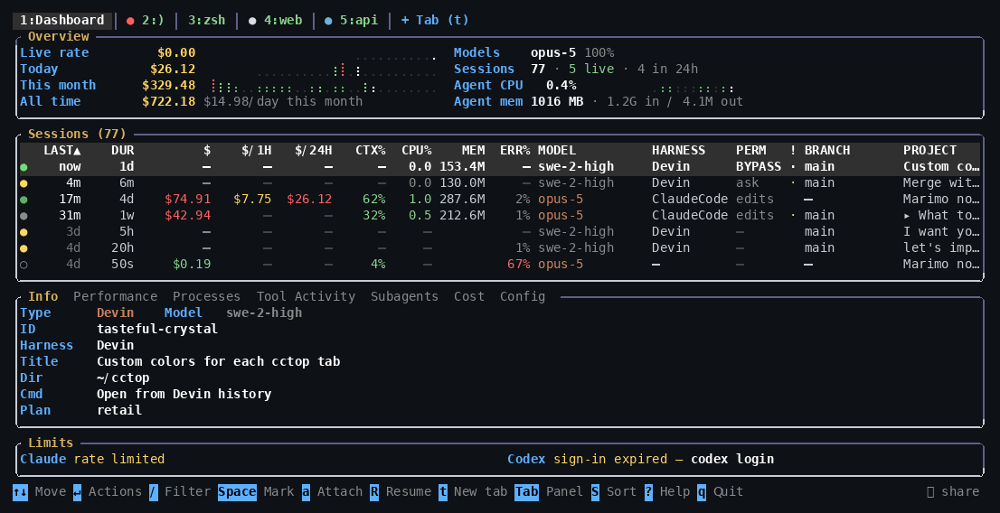

# cctop

> An htop for your AI coding agents. One screen for every Claude Code, Codex,
> Cursor, Devin, Gemini CLI, OpenCode, Pi and Windsurf session on your machine:
> what each is doing, what it has spent, and which one needs you.

[](https://crates.io/crates/cctop)
[](https://github.com/flolep2607/cctop/actions/workflows/ci.yml)
[](#installation)
[](LICENSE)



<sub>A real recording. [Play it in a terminal](docs/assets/demo.cast) with
`asciinema play docs/assets/demo.cast`.</sub>

It reads what the agents leave on disk, so it sees sessions it did not start,
including ones that ended weeks ago. Nothing to configure, nothing to run
alongside it.

## Features

- **Cost.** Tokens times published rates, per session, hour, day and model.
- **Context.** `CTX%` tells you when a window is 68% full. The Context panel
  shows what is in it, including an Unaccounted bar that never claims to be
  smaller than it is.
- **Waiting on you.** The status dot goes amber when an agent needs a reply, and
  turns to a `✓` when a turn ended while you looked elsewhere.
- **Stuck work.** `ERR%` is the share of a session's tool calls that failed. A
  quarter of them means an agent is retrying something that will not work, and
  paying for every attempt.
- **Collisions.** Two agents in one checkout do not cause a merge conflict. They
  cause one agent to overwrite a file the other still holds. The `!` column
  warns you first.
- **Terminals.** A tab is a real terminal you can type into, split and drag.
  `Alt+b` jumps to whichever agent is waiting on you. Its agent runs in cctop's
  own rmux, built in, so it keeps running after you quit and is back in its tab
  next time.

## Installation

> [!IMPORTANT]
> cctop runs on Linux, including WSL. It reads Linux process tables and drives
> agents over ptys and unix sockets. There is no macOS or Windows build.

```bash
curl -fsSL https://raw.githubusercontent.com/flolep2607/cctop/main/install.sh | sh
```

It offers to install `sshfs` as well, for `cctop sandbox`; append
`-s -- --with-sshfs` to `sh` to say yes in advance.

<details>
<summary>Other ways to install</summary>

By hand, from a statically linked release archive. Swap in the aarch64 name on
that architecture.

```bash
d=$(mktemp -d)
curl -fsSL https://github.com/flolep2607/cctop/releases/latest/download/cctop-x86_64-unknown-linux-musl.tar.gz | tar xz -C "$d"
sudo install -m755 "$d/cctop" /usr/local/bin/cctop && rm -rf "$d"
```

```bash
cargo binstall cctop           # fetches the release binary
cargo install cctop --locked   # or compiles it, with the dependencies it was
                               # released with; needs Rust 1.88 or newer
```

From source: `git clone`, `cd cctop`, `cargo build --release`. The binary lands
in `target/release/cctop`.

Checksums and `cctop --update` are in [Installing cctop](docs/install.md).

</details>

## Usage

Run it:

```bash
cctop
```

That is the whole first run. It finds your sessions, prices them, and draws the
table you saw above.

Six keys are worth knowing before anything else:

| Key | |
|---|---|
| `↑` `↓` | move between sessions |
| `←` `→` | move between the panels underneath |
| `/` | filter, on anything a row is |
| `R` | reopen the selected session in a tab of its own |
| `F12` or `Alt+1` | back to the dashboard, leaving the tab running |
| `q` | quit |

> [!TIP]
> Run `cctop --install-hooks` once. The agents then report their own state live
> instead of cctop inferring it from disk. Run `cctop doctor` when something
> looks wrong and it will tell you what.

## Beyond the dashboard

`cctop` can answer an agent (`s`), hand a session's context to a different
harness (`O`), read the sessions on another machine over ssh (`--host`), and
stream the table to a browser. On a phone that last one earns its place, since
the sessions waiting on you can find *you*.

It can also tell you what the money bought.

- [`cctop optimize`](docs/optimize-and-compare.md) finds the reads into
  `node_modules`, the files fetched again after a compaction, and the tool calls
  that failed and were billed anyway. Each finding carries its cost and says
  whether that figure was measured or estimated.
- [`cctop compare`](docs/optimize-and-compare.md) puts your models side by side
  on your own work: how often each got a file right first time, what a changed
  file cost, how long it took. `--rate 60` prices that time too.
- [`cctop yield`](docs/yield.md) asks the repository what became of the spend:
  which sessions' work reached the default branch, which sits on a side branch,
  which was never committed.
- [`cctop recall "why is the cache sharded"`](docs/integrations.md) returns the
  passages of past sessions that discussed it. `cctop --install-mcp` gives the
  same to the agents themselves.

> [!NOTE]
> Most costs are estimates: tokens multiplied by published per-token rates.
> Subscription plans (Claude Max, Pro, Team) charge a flat rate or bundle a
> fixed allowance, so these numbers will not match your invoice. Treat the `$`
> column as a measure of resource consumption rather than billing. `--plan max`
> shows bundled usage as `incl`. [What the cost figures mean](docs/costs.md) is
> honest about which providers report real figures and which get inferred.

## Reference

<details>
<summary>Which agents it reads, and what each one records</summary>

| Agent | Cost | Tokens | Context | Tools | Live process |
|---|---|---|---|---|---|
| Claude Code | estimated | ✓ | ✓ full breakdown | ✓ | ✓ |
| Codex | estimated | ✓ | ✓ | ✓ | ✓ |
| OpenCode | reported | ✓ | ✓ | ✓ | ✓ |
| Pi | reported | ✓ | ─ | ✓ | ✓ |
| Gemini CLI | estimated | ✓ | ─ | ✓ | ─ |
| Devin | ─ | ✓ | ✓ | ✓ | ✓ |
| Cursor | ─ | ─ | ─ | ✓ | inferred |
| Windsurf | ─ | ─ | ─ | ✓ | ─ |

A `─` marks something the harness does not record, which is a different thing
from something cctop cannot show. Each [provider's page](docs/providers/) has the
detail. Devin records tokens, context, tools and a live process, and no money at
all.

</details>

<details>
<summary>Commands</summary>

```bash
cctop                 # interactive UI
cctop --list          # print a table and exit
cctop --json          # dump full session data as JSON
cctop --statusline    # one line for a status bar: "3 working · 1 waiting · $4.12/h"
cctop --plan max      # treat Claude usage as bundled
cctop --host devbox   # also show another machine's sessions, read over ssh
cctop sandbox devbox:/srv/api   # Claude here, its commands and files on devbox
cctop doctor          # check this installation and say what is wrong with it
cctop serve           # the same table in a browser, on a port or a phone
cctop claude          # start an agent on a pty cctop can watch and type into
```

`cctop --help` has the rest.

</details>

## Documentation

- [Reading the table](docs/the-table.md) - every column, the status dot,
  filtering, and the full key list
- [Driving agents](docs/driving-agents.md) - typing into sessions, resuming,
  tabs and splits, notifications
- [In a browser](docs/serve.md) - `cctop serve`, the session report, and
  reaching it from a phone
- [The bottom panels](docs/panels.md) - Tool Activity and the context breakdown

Then, if you want the detail: [what it cost you for](docs/optimize-and-compare.md)
· [did the spend ship](docs/yield.md) · [what the subscription bought](docs/subscription-burn.md)
· [what the cost figures mean](docs/costs.md) · [provider by provider](docs/providers/)
· [integrations](docs/integrations.md) · [troubleshooting](docs/troubleshooting.md)