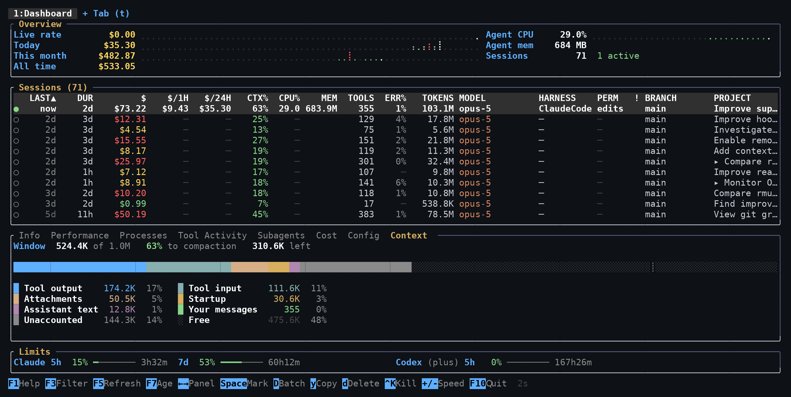

# The bottom panels

[← back to the README](../README.md)

The panel under the table describes whichever session the cursor is on. `←` and
`→` move between panels, `1`–`7` jump to one, `Tab` reaches Context, and
`Shift+↑`/`↓` scrolls inside the active one.

Two of them repay a closer look.

## Tool Activity

Each invocation shows the time, its arguments, and — where the transcript
supports it — what it did:

```
19:16 main    ~/cctop/src/ui/render.rs     +43 -24   122ms ↓498.5K ↑ 1.2K
19:34 ↳aa1b82 ~/cctop/src/quota.rs          +2 -0    88ms ↓ 41.2K ↑  310
19:41✗main    cargo test --all-targets               1.4s  ↓ 12.0K ↑  180
```

- **origin** — `main` for the session itself, or `↳<agent-id>` for a subagent.
  Subagent activity is interleaved into the same log, so without this there's no
  way to tell an agent's edits from the parent's.
- **`✗` and a red row** — the call reported an error. Claude records this per
  call, OpenCode and Gemini record a tool status, and Codex is read from the
  sandbox's own result line and exit code. Cursor and Windsurf transcripts don't
  record tool outcomes, so their calls are never marked.
- **`+N -M`** — lines added and removed, from the edit result's patch.
  Press `v` to expand the diff inline beneath the row.
- **duration** — wall time from the call being issued to its result arriving.
- **`↓` / `↑`** — tokens in and out for the assistant turn that issued the call.
  Claude only; Codex transcripts don't tie token counts to individual calls.

That last one deserves a caveat: **billing is per API request, not per tool
call.** When one turn issues several calls they all show that turn's figures,
marked with a leading `*`. Dividing the total between them would invent
precision the transcript doesn't contain. `↓` includes cache reads, which is why
it tracks total context size rather than the size of any one call.

Codex tools are decoded too: `apply_patch` shows the files it touched and its
line counts, `update_plan` shows progress and the step in flight, and
`write_stdin` distinguishes a real write from a poll for more output.

## Context breakdown



`CTX%` says the window is 68% full. The **Context** panel says what is in it —
Claude sessions only, since no other provider's transcript reports per-request
usage.

```
Window   181.4K of 200K

Unaccounted    ━━━━━━━━━━━━━━━━────────────────────────   62.1K  34%
Tool output    ━━━━━━━━━━━━────────────────────────────   43.5K  24%
Startup        ━━━━━━━━━───────────────────────────────   34.5K  19%
Tool input     ━━━━━━━━────────────────────────────────   29.0K  16%
Attachments    ━━━━────────────────────────────────────    9.1K   5%
Assistant text ━━──────────────────────────────────────    3.6K   2%
```

Two of those numbers are measured and the rest are estimated, and the panel
never blurs the line:

- **Window** and **Startup** come from the usage figures the API itself
  reported. Startup is the first request of the live segment — everything the
  harness sends before the conversation begins: the system prompt, the tool
  schemas, CLAUDE.md, the skills index, and, after a compaction, the summary. It
  cannot be split further, because the transcript never records what was sent,
  only that it was.
- **Tool output**, **Tool input**, **Attachments**, **Your messages** and
  **Assistant text** are estimated from how many characters the transcript
  holds, at 2.75 characters per token. That constant is fitted rather than
  assumed: across 167 local sessions, the characters a transcript accumulates
  divided by the context growth the API reports over the same span lands there,
  well under the usual prose rule of thumb because this content is mostly code,
  JSON and file paths.
- **Unaccounted** is the remainder, and it is deliberately a bar of its own
  rather than being spread across the categories that happen to be measurable.
  It runs around a third of the window. Most of it is thinking — Claude Code
  writes those blocks with the text stripped and only the signature left, so
  there is nothing to measure — plus the `<system-reminder>` text the harness
  splices into each turn without recording it, plus estimation error.

A compaction resets the whole thing: everything before the summary has left the
window, so counting across one would describe a context that no longer exists.
Subagent turns are excluded too — they run against their own windows, and only
the report a subagent hands back is in the parent's, where it lands in **Tool
output** like any other result.

When the estimate overshoots the window there is no gap to draw, and the panel
says so instead of clamping: it means the harness has dropped context that the
transcript still holds.

Under the bar, **How it filled** charts the window across every request the
session made. The bar answers "what is in there"; the chart answers "how did it
get that full", which is the part that changes what you do next. A window that
climbed evenly is a conversation that grew and will keep growing. One that
stepped is a handful of large tool results, and the same call will do it again.
A sawtooth is a session living on compactions, paying to rebuild its context
over and over. The chart spans the whole session rather than the live segment,
because a compaction is the most interesting thing that can happen to a context
window and it is the only view that can show one.
