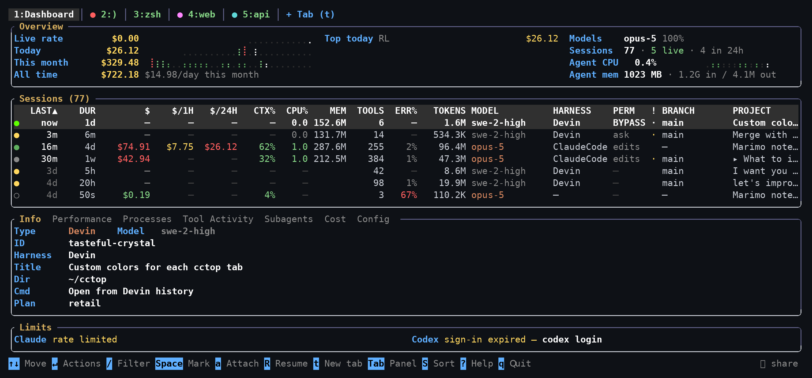

# Reading the table

[← back to the README](../README.md)

One row per session, whether it is running now or ended weeks ago. Columns drop
from the right as the terminal narrows, worst-informing first, so the ones that
say *which session this is* survive to the last. Hover any header for what it
means, click one to sort by it, or press `F6` for the sort list.

Hide columns you never read with `$CCTOP_COLUMNS_HIDE`, a comma-separated list
of the keys below — `CCTOP_COLUMNS_HIDE=tok_rate,mem`.



## The columns

| Column | Key | What it says |
|---|---|---|
| (dot) | `status` | Whether the session is running, and what it is doing — see below |
| `LAST` | `active` | Time since the session last did anything |
| `DUR` | `duration` | First to last activity |
| `$` | `cost` | Estimated cost — see [What the cost figures mean](costs.md) |
| `$/1H` | `cost_hour` | Estimated cost in the current clock hour |
| `$/24H` | `cost_today` | Estimated cost since local midnight |
| `CTX%` | `ctx` | Context window used, as a share of the auto-compact threshold. `COMPCT` while one is happening |
| `CPU%` | `cpu` | CPU across the session's process tree |
| `MEM` | `mem` | Resident memory across the session's process tree |
| `TOOLS` | `tools` | Tool invocations |
| `ERR%` | `errors` | Share of those calls that failed — see below |
| `TOKENS` | `tokens` | Input plus output |
| `TOK/m` | `tok_rate` | Token rate, smoothed |
| `MODEL` | `model` | Model in use |
| `HARNESS` | `harness` | The host application — Cursor, a terminal CLI — as distinct from the model. `─` rather than a guess |
| `PERM` | `perm` | How much it asks before acting — see below |
| `!` | `conflict` | Another agent is on the same ground — see below |
| `HOST` | `host` | Which machine, when [reading more than one](integrations.md#more-than-one-machine). Hidden otherwise |
| `USER` | `user` | Whose session it is, when [watching every user](integrations.md#every-user-on-the-machine). Blank for your own, hidden otherwise |
| `BRANCH` | `branch` | Branch checked out in the working directory, `@<commit>` when detached, `─` when not a repository |
| `PROJECT` | `project` | The session's title if it has one, otherwise its working directory |

## The status dot

The left status dot is green while an agent is working, amber after its latest
response is waiting for your input, and red when the newest transcript event is
an API error. A hollow grey dot is a stopped session, and a filled `◉` is the
session that rang in the last 30 seconds.

## `PERM` — how much a session asks

**PERM** is how much a session asks before it acts: `ask`, `edits` (writes files
unasked), `plan` (cannot act at all), or a red `BYPASS` for one started with
`--dangerously-skip-permissions`. Read from the transcript, and kept current by
the session's own hooks when it has them. `─` means the harness does not record
it — today only Claude Code does.

## `ERR%` and compaction cadence — sessions that are not getting anywhere

A session can be busy and expensive without getting anywhere, and the columns
that measure how hard it is working all read *higher* when that happens. Two
that read the other way:

**`ERR%`** is the share of a session's tool calls the transcript reported as
failed. A few is ordinary — a grep that found nothing, a build that caught a
mistake. A quarter of them is an agent retrying something that will not work,
paying full price for each attempt. Sort by it with `F6` to put those at the
top; the Info panel gives the two numbers behind the rate, and Tool Activity
marks the individual calls with `✗`.

It reads `─` where the harness records no per-call outcome — Cursor, Pi and
Windsurf — rather than `0%`, which would claim a clean run cctop cannot see.
Claude, Codex, Gemini and OpenCode all report one.

**Compaction cadence** is under the Context panel's chart. The sawtooth in that
chart is already the shape of a session living on compactions, but three of them
over two days is a long conversation while three in twenty minutes is a session
that will spend the rest of the day rebuilding a window it keeps refilling — and
the chart draws those identically. From three compactions on, the panel says how
often: `↺ one compaction every 15m`. Claude Code only, since no other transcript
records that a compaction happened.

## `!` — when two agents are in one repository

Two agents editing one checkout is not a merge conflict. Git would at least
announce that. It is one of them writing a file the other is still holding in
context, and the loser finds out when the work is already gone. cctop is the
only thing on the machine that can see both of them, so it is the only thing
that can say so while it still helps.

The `!` column is that warning:

| | |
|---|---|
| `⚠` | another running agent has written a file this session also wrote |
| `·` | another running agent is in the same repository, and has not touched your files |
| (blank) | nobody else is here |

Sort by it with `F6`, and the Info panel names the peer and lists the files. The
footer carries the `⚠` case only — agents share repositories all day and nothing
has gone wrong yet, whereas two of them writing one file means an edit has
already been lost or is about to be.

The unit of comparison is the **repository root**, not the working directory. A
linked worktree carries its own `.git`, so two agents in two worktrees of one
repository are editing two sets of files on disk and are not reported; two
agents started from different subdirectories of one checkout are. Comparing
directories gets both of those backwards, and the second is the arrangement
`git worktree` exists to provide.

Three limits worth knowing. Only running sessions are compared — a session that
has stopped may well have left uncommitted work behind, but nothing it does from
here can race anyone. Only the last 32 files each session wrote are watched, so
a path it finished with an hour and forty edits ago is not treated as contested.
And a Codex `apply_patch` covering several files summarises as
`first.rs (+3 more)` in the transcript, so only the first of them is recovered.

Agents can ask this themselves through `check_conflicts` — see
[Letting agents see each other](integrations.md#letting-agents-see-each-other).

## Finding a session

`/` filters the table as you type, on everything a row is: its label or title,
the full working directory (not just the abbreviation the column has room for),
the git branch, the model, the harness, the provider and the session id. The
cell that matched is underlined, so it is clear *why* a row survived the filter.
`n` and `N` step through matches, `Esc` clears, and `↑`/`↓` inside the prompt
bring back a search you ran before — the last twenty are remembered across runs.

`Tab` widens the search to the transcripts themselves, which is how you find the
session where something was actually discussed rather than one whose name
happens to mention it. Transcript matches are added to the metadata matches
rather than replacing them, and the line each one was found on is shown under
the prompt.

This reads every transcript on disk, so it is opt-in, it waits for a pause in
typing and for a query of at least three characters, and it runs on cctop's
background thread pool — the table stays live throughout, and the footer says
`+transcripts…` while a scan is out. Results are remembered per query, so
refining a search re-reads only what it must. Two limits are worth knowing:
transcripts store their text as JSON, so a phrase containing a quote or a
newline is escaped on disk and will not match; and a single session is scanned
up to 64 MiB.

## The row menu

Every action below has a key, and the keys are worth learning. But you have to
know they exist first, and a key that quietly declines — because the row is on
another machine, or is a subagent, or has no process left to signal — teaches
nothing about why.

`Enter` on a row opens everything you can do to it:

```
╭ Improve super cctop ─────────────────────────────────────╮
│ Resume in a tab                                        R │
│ Attach to it                                           a │
│ Type into it               no local process to type into │
│ Hand off to another agent                              O │
│ Show its subagents                                     e │
│ Mark for a batch action                            space │
│ ──────────────────────────────────────────────────────── │
│ Terminate the agent                    it is not running │
│ Delete the transcript                                  d │
╰ ↑↓ Enter · Esc ──────────────────────────────────────────╯
```

Entries that cannot run stay on the list, greyed, with the reason where their
key would be — one or the other, never both, since pressing the key of a
refused entry only repeats the refusal. They are not hidden: a menu that
changed shape from row to row would teach you less than one that says why.

The cursor never lands on a refusal, so `Enter` always does something. The
letters stay live inside the menu, so `Enter` `R` and a plain `R` are the same
two keystrokes — the menu shows the shortcuts rather than replacing them.
Clicking works too. `Esc`, or a click outside, closes it.

## Every key

| Key | Action |
|-----|--------|
| `Enter` | Everything you can do to this row, in one menu (see above) |
| `↑`, `↓`/`j` | Move between sessions |
| `PgUp`, `PgDn` | Page up / down |
| `Ctrl+U`, `Ctrl+D` | Half a page up / down |
| `g`, `G` | Jump to first / last |
| `Home`, `End` | Jump to first / last |
| `n`, `N` | Next / previous search match (wraps) |
| `w` | Toggle notifications (see below) |
| `b` | Jump to the session that rang last |
| `←`, `→` | Move between bottom panels |
| `1`–`7` | Jump to a panel directly (`Tab` also reaches Context, the eighth) |
| `Shift+↑`/`↓` | Scroll inside the active panel |
| `f` | Follow mode: keep the selection centered |
| `/` or `F3` | Filter sessions by text (see below) |
| `F6`, `>`, `<` | Sort-by panel |
| `F7` | Filter by age (1d / 1w / 1mo) |
| `#` | Cost floor: only sessions costing ≥ `$X` |
| `` ` `` | Show only running sessions |
| `[`, `]` | Move through the Tool Activity tool filter |
| `v` | Toggle inline diffs for edits |
| `L` | Toggle the Tool Activity live filter |
| `P` / `M` / `T` | Sort by status / memory / cost |
| `H` / `X` / `S` | Sort by harness / context / tools |
| `+`, `-`, `=` | Speed up / slow down / reset refresh interval |
| `Space` | Mark / unmark the selected session |
| `D`, `K` | Delete / terminate all marked sessions (with confirmation) |
| `U` | Clear all marks |
| `h` or `F8` | Agent integration: what reports to cctop, and install it |
| `y` | Copy resume command or transcript path |
| `d` | Delete the selected session (not running) |
| `k` | Terminate the selected live session (with confirmation) |
| `s` | Type a line into the selected session's terminal (see below) |
| `R` | Resume the selected session in a tab of its own (see below) |
| `O` | Hand the selected session's context off to a different agent (see below) |
| `a` | Open that session's terminal in a tab and drive it |
| `t` | New tab: run an agent or a shell (see below) |
| `Esc` | Clear the active filter |
| `q` or `F10` | Quit |

Tabs and splits, from anywhere including inside a running agent:

| Key | Action |
|---|---|
| `t` or `Alt+n` | New tab: an agent, a shell, or one still running |
| `Alt+v` / `Alt+s` | Split the current tab right / down |
| `Alt+←` / `Alt+→` | Previous / next tab |
| `Alt+1`–`9` | Jump to a tab; `Alt+1` is the dashboard |
| `Alt+o` | Move focus to the next pane |
| `Alt+w` | Close the focused pane and stop its agent |
| `Alt+Shift+W` | The same thing, by a name that says so |
| `F12` | Back to the dashboard, leaving everything running |

Every function key is cctop's, inside a pane as much as on the dashboard: none
of them is passed to the agent. `F10` (quit) and `F5` (refresh) act where you
press them; `F12` returns to the dashboard; `F1`, `F3`, `F6`, `F7`, and `F8`
bring the dashboard forward and then do what they do there, since a search box
or a sort order over a pane would be drawn on a screen the agent is repainting.
An unbound function key does nothing rather than reaching the agent as an escape
sequence.

Mouse works too: click session rows, column headers, and panel tabs; scroll
anywhere. In Tool Activity, click any row to expand the full untruncated
argument, and click the sidebar to filter by tool.

In the tab bar, drag a tab to move it along the bar, and right-click one to
rename it: `3:claude-4` says nothing about what that agent is doing, and the
name you give it follows the tab into every cctop on the machine.
